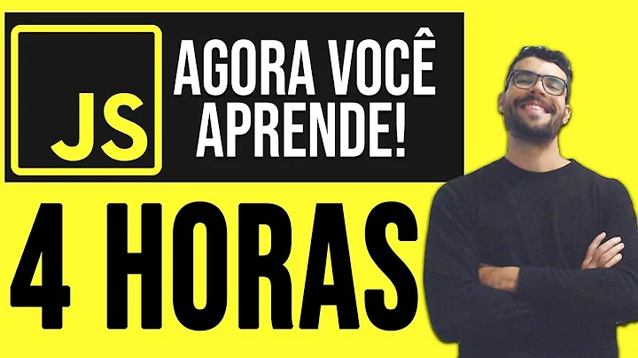

<h1 align="center"> Curso de Javascript | Dev Aprender 🖥️ </h1>

## Overview

Este repositório destina-se a armazenar as atividades elaboradas durante o Curso Javascript Completo 2023 [Iniciantes] + 14 Mini-Projetos, ministrado por Jhonatan de Souza.

## Conhecimentos Adquiridos

Durante o curso, adquiri conhecimentos abrangentes, incluindo, mas não se limitando a:

    Instalação do VS Code
    Variáveis e Constantes
    Tipos Primitivos e Tipagem Dinâmica em Javascript
    Objetos e Arrays
    Functions e Tipos de Funções
    Operadores (Aritméticos, de Atribuição, de Igualdade, Ternário, Lógicos)
    Comparações não Booleanas e Troca de Valores de Variáveis
    Estruturas Condicionais (If..Else, Switch..Case)
    Laços de Repetição
    Factory Functions e Constructor Functions
    Natureza Dinâmica de Objetos e Clonagem de Objetos
    Utilização de Math, String, Template Literal e manipulação de Date
    Introdução e Manipulação de Arrays
    Arrow Functions e manipulação avançada de Arrays (adicionar, encontrar, remover, esvaziar, combinar)
    Operador Spread e Foreach
    Interatividade com o usuário (Input - Como receber dados do usuário)
    Introdução à manipulação do DOM

Mini-Projetos Desenvolvidos

Ao longo do curso, desenvolvi 14 mini-projetos práticos para aplicar e solidificar os conceitos aprendidos, finalizando com o projeto final. Aqui estão os links para cada um deles:

- [Projeto 1](miniProjeto01.js)
- [Projeto 2](miniProjeto02.js)
- [Projeto 3](miniProjeto03.js)
- [Projeto 4](miniProjeto04.js)
- [Projeto 5](miniProjeto05.js)
- [Projeto 6](miniProjeto06.js)
- [Projeto 7](miniProjeto07.js)
- [Projeto 8](miniProjeto08.js)
- [Projeto 9](miniProjeto09.js)
- [Projeto 10](miniProjeto10.js)
- [Projeto 11](miniProjeto11.js)
- [Projeto 12](miniProjeto12.js)
- [Projeto 13](miniProjeto13.js)
- [Projeto 14](miniProjeto14.js)
- [Projeto Final](projetoFinal)